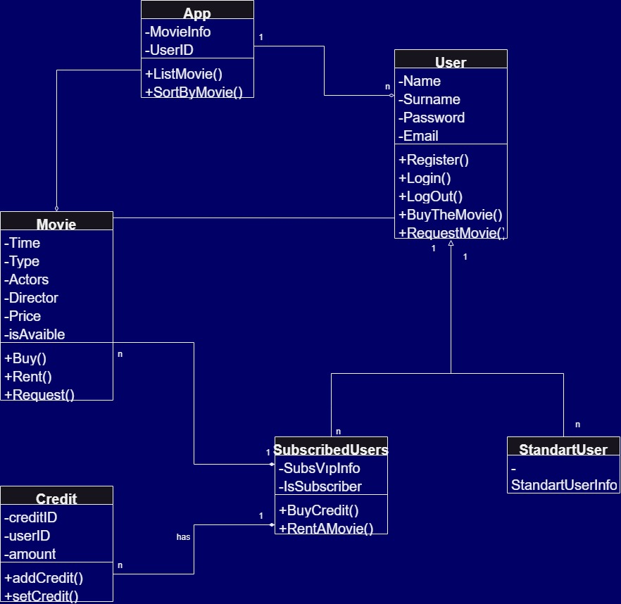

>Online film satan veya kiralayan uygulama class diagram sistemi
***
* Uygulamada filmler listelenebilir, sıralanabilir ve kullanıcılar uygulamaya abone olabilir.
* Kullanıcılar abonelik için sistem üzerinden kredi satın alır.
* Sadece abone olan kullanıcılar, kredileri ile film kiralayabilir ve kiraladığı filmin kredi bedeli kadar hesabından düşülür.
* Normal kullanıcılar ve aboneler film satın alabilirler.
* Eğer film mevcut değil ise talep edilebilir.
***
>Application class diagram system that sells or rents movies online
***
* Movies can be listed and ranked in the app and users can subscribe to the app.
* Users purchase credits through the system for subscription.
* Only subscribed users can rent movies with their credits and the credit amount of the rented movie is deducted from their account.
* Regular users and subscribers can purchase movies.
* If the movie is not available, it can be requested.
***
***
